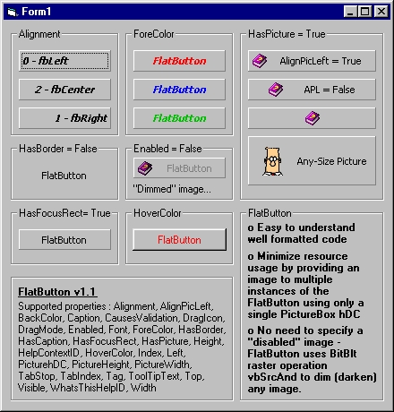



## FlatButton V1\.1 \- wicked ;0\)

### Description

This Active X control acts as a replacement for the standard Command Button. This code is a great example for a beginner to learn Active X control creation. Really its pretty much the same as my earlier posting, but ppl seemed to gloss over what it can do. Thanks to Henning Tillman (the author of the code on which this button is based).
 
### More Info
 
See Zip

             |
---                |---
**Submitted On**   |2000-08-13 21:52:36
**By**             |[Wayne Hartell](https://github.com/Planet-Source-Code/PSCIndex/blob/master/ByAuthor/wayne-hartell.md)
**Level**          |Intermediate
**User Rating**    |4.8 (19 globes from 4 users)
**Compatibility**  |VB 5\.0, VB 6\.0
**Category**       |[OLE/ COM/ DCOM/ Active\-X](https://github.com/Planet-Source-Code/PSCIndex/blob/master/ByCategory/ole-com-dcom-active-x__1-29.md)
**World**          |[Visual Basic](https://github.com/Planet-Source-Code/PSCIndex/blob/master/ByWorld/visual-basic.md)
**Archive File**   |[CODE\_UPLOAD89128132000\.zip](https://github.com/Planet-Source-Code/wayne-hartell-flatbutton-v1-1-wicked-0__1-10646/archive/master.zip)

### API Declarations

See Zip

